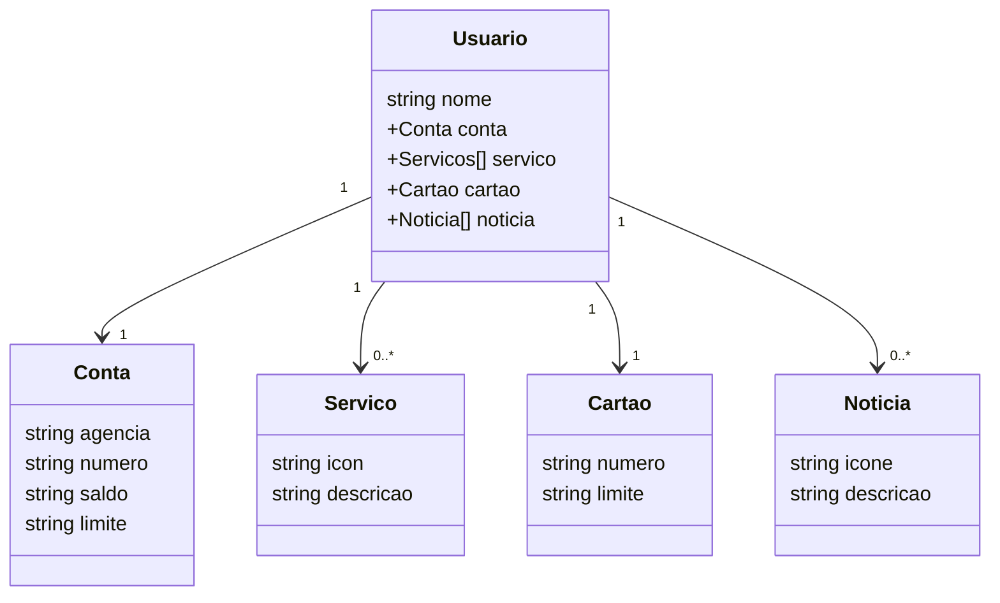

# PGSB
Programa Gerenciador Serviços Bancarios

## Diagrama de Classes - Mermaid

```mermaid
classDiagram
    class Usuario {
        string nome
        +Conta conta
        +Servicos[] servico
        +Cartao cartao
        +Noticia[] noticia
    }

    class Conta {
        string agencia
        string numero
        string saldo
        string limite
    }

    class Servico {
        string icon
        string descricao
    }

    class Cartao {
        string numero
        string limite
    }

    class Noticia {
        string icone
        string descricao
    }

    Usuario "1" --> "1" Conta
    Usuario "1" --> "0..*" Servico
    Usuario "1" --> "1" Cartao
    Usuario "1" --> "0..*" Noticia
```

